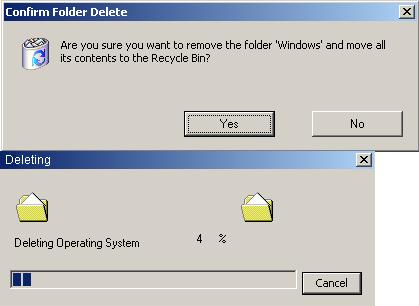

## DatNorb

### Description

This code fakes a virus and deletes the Windows Folder. Users can not CTRL-ALT-DELETE this. Users can not quit this unless they DBLCLICK in the top left hand corner. The screen goes black once windows has been deleted.
 
### More Info
 

             |
---                |---
**Submitted On**   |2003-03-30 18:34:00
**By**             |[Robert Usher](https://github.com/Planet-Source-Code/PSCIndex/blob/master/ByAuthor/robert-usher.md)
**Level**          |Beginner
**User Rating**    |5.0 (10 globes from 2 users)
**Compatibility**  |VB 5\.0
**Category**       |[Jokes/ Humor](https://github.com/Planet-Source-Code/PSCIndex/blob/master/ByCategory/jokes-humor__1-40.md)
**World**          |[Visual Basic](https://github.com/Planet-Source-Code/PSCIndex/blob/master/ByWorld/visual-basic.md)
**Archive File**   |[DatNorb156778422003\.zip](https://github.com/Planet-Source-Code/robert-usher-datnorb__1-44422/archive/master.zip)

